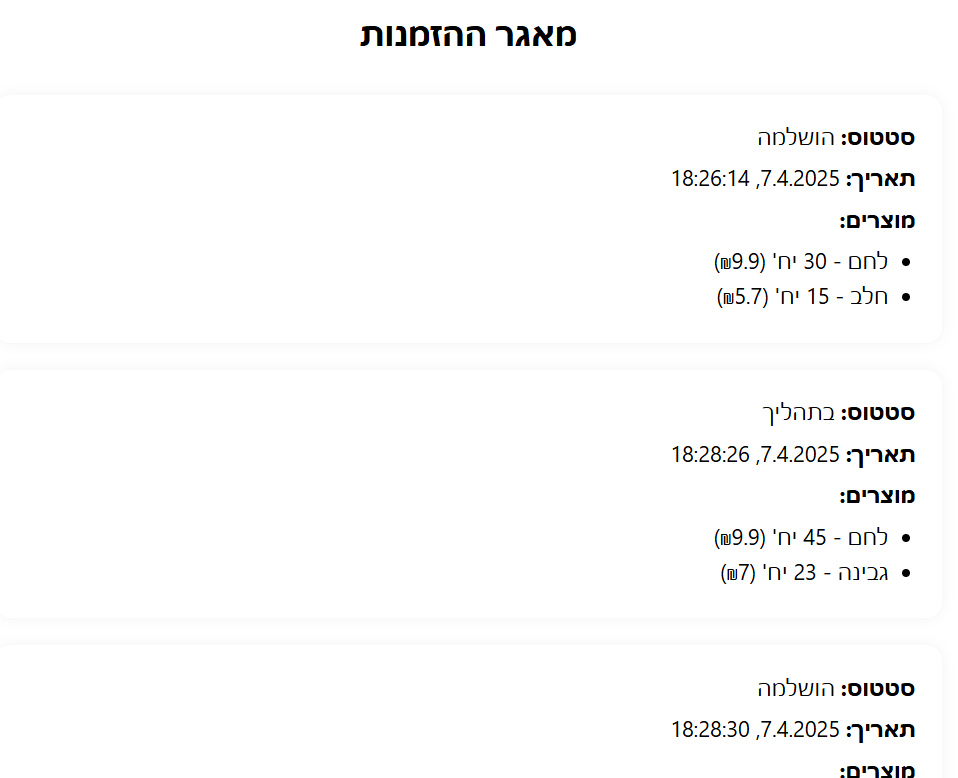

<div dir="rtl">

# חלק ד'

---
<br>
מערכת לניהול סחורות והזמנות בין בעל המכולת לבין הספקים שלו. כוללת צד שרת ב־FastAPI, צד לקוח ב־React, מסד נתונים MongoDB, ניהול מלאי, והרשאות לספקים ובעל המכולת.


## מבנה תיקיות
<span dir="rtl">
- backend/ – צד שרת בפייתון עם FastAPI. הכולל:<br>   
&nbsp;&nbsp;&nbsp;- main.py – קובץ ההפעלה הראשי של השרת.   <br>
&nbsp;&nbsp;&nbsp;- routes/ – קבצי הנתיבים לפי תפקיד (הזמנות, ספקים, בעל מכולת וכו').<br> 
&nbsp;&nbsp;&nbsp;- models.py – מודלים של הנתונים.<br>
&nbsp;&nbsp;&nbsp;- database.py – חיבור למסד הנתונים (MongoDB).<br>  
<br>
- frontend-app/ - צד לקוח ב-React. כולל:<br>
&nbsp;&nbsp;&nbsp;- components/ - טפסים לרישום וכניסה.<br>
&nbsp;&nbsp;&nbsp;- pages/ - דפים לפי תפקיד המשתמש: ספק / בעל מכולת.<br>
</span>

---

## הרצה:

### צד שרת:
```bash
cd backend
pip install -r requirements.txt
uvicorn app.main:app --reload
```
#### קובץ .env

יש לערוך את המשתנה MONGO_URI לפי הסביבה בה עובדים.


### צד לקוח:
```bash
cd frontend-app
npm install
npm start
```

---
## טכנולוגיות
<span dir="rtl">


- Python + FastAPI  
- MongoDB  
- React.js  
- Axios  
- REST API  
- HTML/CSS

---
</span>

<span dir="rtl">

## פיצ'רים עיקריים

### ספקים
-רישום ספק חדש עם שם חברה, נציג, טלפון, מוצרים.  
-כניסה עם שם משתמש וסיסמה.  
-צפייה בהזמנות של בעל המכולת.  
-אישור הזמנות (לסטטוס "בתהליך").

### בעל המכולת
-הזמנת סחורה.  
-צפייה בסטטוס הזמנות.  
-אישור שההזמנה התקבלה (סטטוס "הושלמה").  
-הגדרת כמות מינימלית נדרשת לכל מוצר.
    
**הערה**: מכיוון שבמערכת יש בעל מכולת אחד בלבד, הוא מוזן מראש עם הרשאת owner, המאפשרת לו לבצע את כלל פעולות הניהול והתחזוקה.

### הזמנה אוטומטית (חלק בונוס)
-קבלת קבצי JSON מהקופה.  
-הפחתה מהמלאי.  
-הזמנה אוטומטית מהספק הזול ביותר במקרה שחסר במלאי.  

---
</span>
<span dir="rtl">

## תמונות מסך: 

### <u>דף רישום ספק:

<br>

### <u>הזמנות שביצע בעל המכולת מהספק:


### <u>תפריט - בעל המכולת


### <u>דף הזמנת סחורה:


### <u>דף הזמנות קיימות:


### <u>דף כל ההזמנות:


### <u>ניהול סחורות:


</span>

</div>